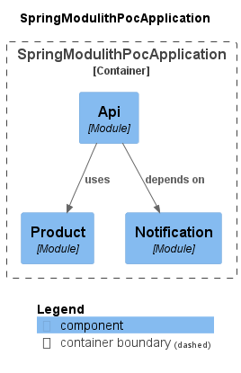

# Spring Modulith POC
This is a POC project for Spring Modulith framework.

## Getting Started
### Requirements
* Java 17
* Gradle 8.1.1
* Spring Boot 3

### How to run
To run application locally use the next gradle command: 
`gradlew bootRun`

## Code
### Modules
```
Modules:
# Product
> Logical name: product
> Base package: com.latsyna.spring.modulith.product
> Spring beans:
  o ….internal.ProductServiceImpl

# Notification
> Logical name: notification
> Base package: com.latsyna.spring.modulith.notification
> Spring beans:
  + ….NotificationService

# Api
> Logical name: api
> Base package: com.latsyna.spring.modulith.api
> Spring beans:
  + ….NotificationApi
  + ….ProductApi
```
### Diagram


## Reference documentation
* https://www.baeldung.com/spring-modulith
* https://docs.spring.io/spring-modulith/docs/1.0.0-SNAPSHOT/reference/html/#preface